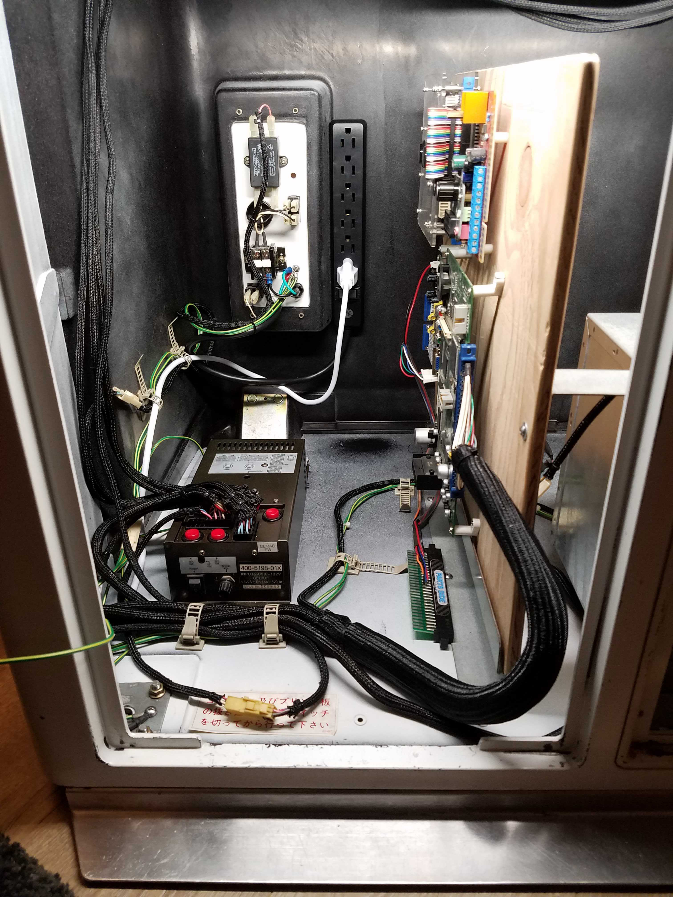
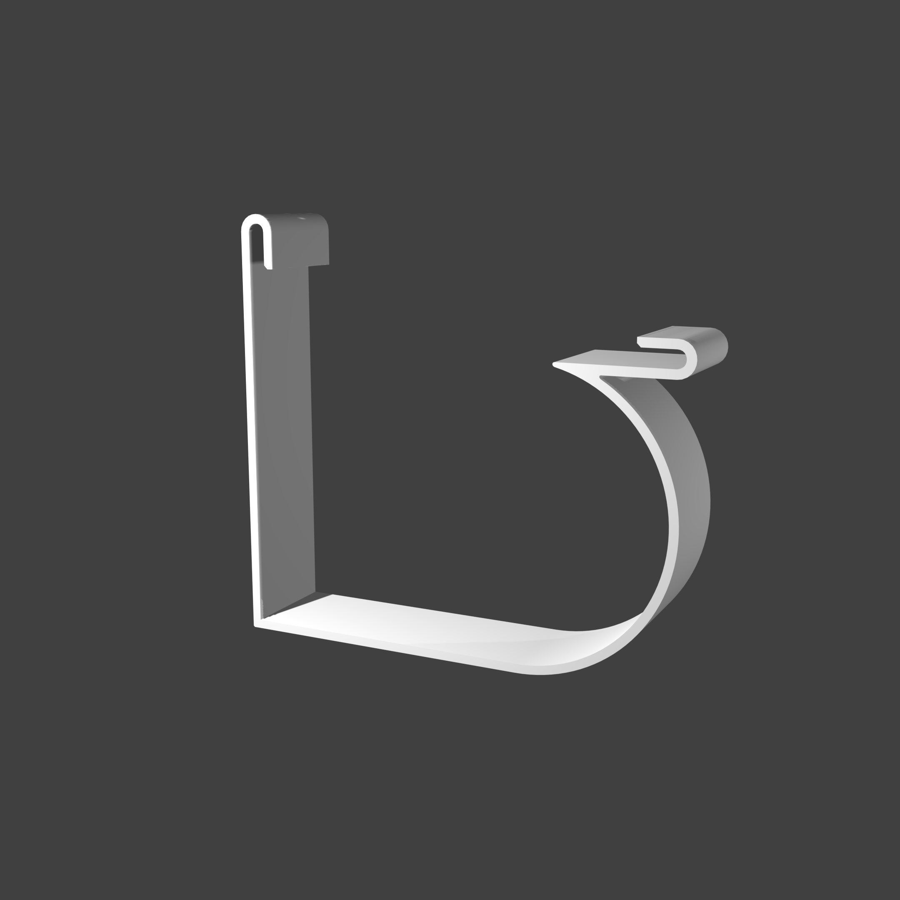
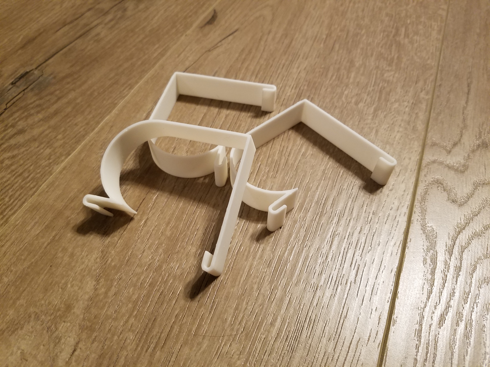
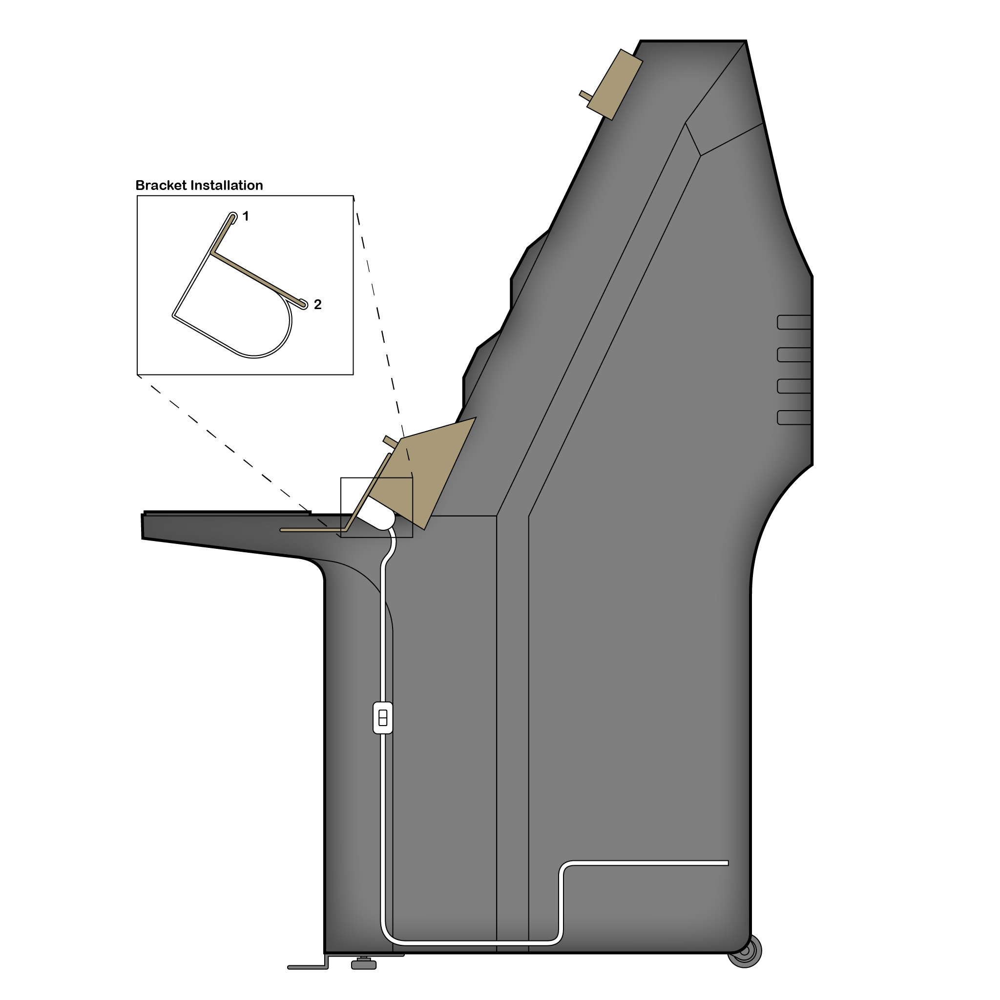
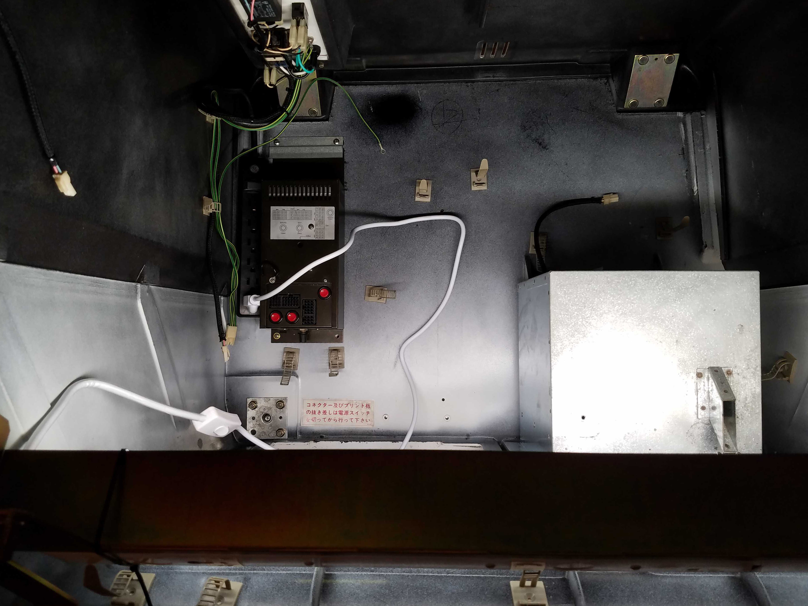
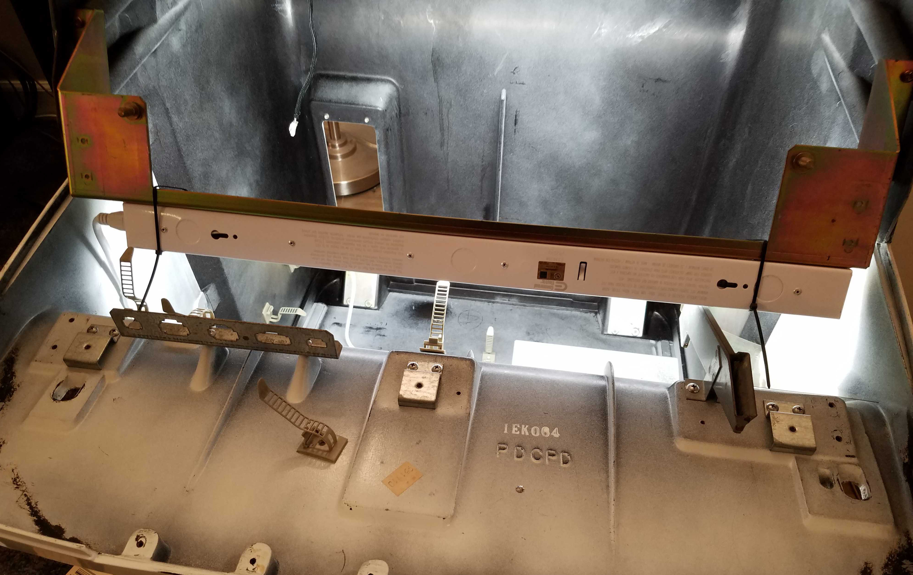
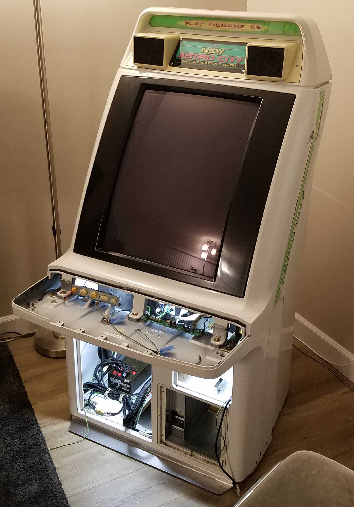
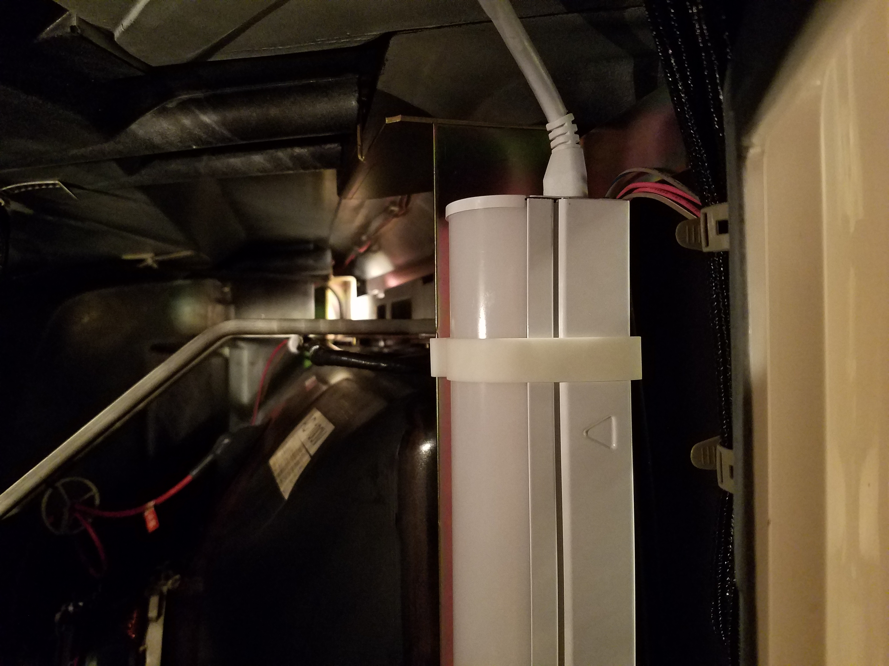

# New Astro City Service Light Brackets
 
3D printed bracket clips to non-destructively mount a service LED light inside a Sega New Astro City arcade cabinet. More images of the installed light soon!

-----

## Overview

When working on my New Astro City, I noticed that the interior could get quite dark; doing maintenance tasks or connecting new game boards was often inconvenienced by the poor visbility. I decided to mount a 24" LED light fixture inside the cabinet, to provide some much-needed extra illumination. Initially, I held the light fixture in place with zip-ties; however, I wanted something that was sturdier and more aesthetically pleasing. I also wanted anything I used to be non-destructive to the cabinet.

To this end, I designed some custom 3D-printable bracket clips to securely mount the light fixture along the lower edge of the monitor support frame.

## Design & Printing

The clips are designed to attach to the lower part of the monitor support frame (the metal structures that are above and below the monitor, and that hold the four corner bolts used to secure it in place). They are made to be printed at 100% fill, and are currently specced for use with a resin printer. They are designed to flex slightly during the installation process, so it may be necessary to adjust the thickness or other print properties if printing them with an FDM printer or with a different material.

The [.blend](./Astro_City_TubeLight_Clip.blend) and [.stl](./Astro_City_TubeLight_Clip_15mmThickness.stl) files have been included; feel free to modify them and use them in your own applications.

This print has been validated with the following print settings and postprocessing:

- Formlabs Form2 printer
- White V4 standard resin
- 0.1mm layer height
- 100% scale
- 20 minute isopropyl acohol bath
- 60 minute curing time at 60°C, under UV light bulbs
- Lightly sanded to remove support markings

A quick test to ensure the print is properly scaled: as designed, the bracket clips are exactly 15mm wide.

## Installation

The lamp chosen for the installation was a Commercial Electric 24" 900 Lumen fixture; it was selected because it was the largest size AC-powered LED fixture I could find at my local hardware store that would fit within the cabinet. [Here is a link to the specific model I used.](https://www.homedepot.com/p/Commercial-Electric-2-ft-10-Watt-Plug-in-Direct-Wire-Integrated-LED-White-Linkable-Strip-Light-Fixture-900-Lumens-4000K-Bright-White-54263191/313258653?) The critical dimensions for use of this clip as-designed are a 40x40mm square tubular section body, and a 20mm semicircular radius bulb extending from one face of the tube section.

A minimum of two clips are necessary for secure installation; I chose to use three for my cabinet.

The bracket clips are designed with a two-stage mounting process, as shown in the diagram above:

1. Hook the top edge of the clip over the upper edge of the monitor frame, from below. Feed the round portion of the bracket clip around the LED fixture.
2. Pull the remaining clip edge inwards, towards the rear of the cabinet, while lifting it up. It should 'click' into place securely around the longer edge of the monitor frame.

When mounted, the clip should be snug enough that it will not slide from side to side without some effort, but not so tight that it cannot move when pushed firmly.

## Photos

Multiple views to show the extra illumination from the service light.

This image shows the original temporary mount solution with zip ties. It should help contextualize where in the cab the light is located.

A view of the cabinet, showing the illumination provided by the service light.

A view from the PCB maintenance door, looking upward at a clip and the light fixture as installed in the cabinet.

